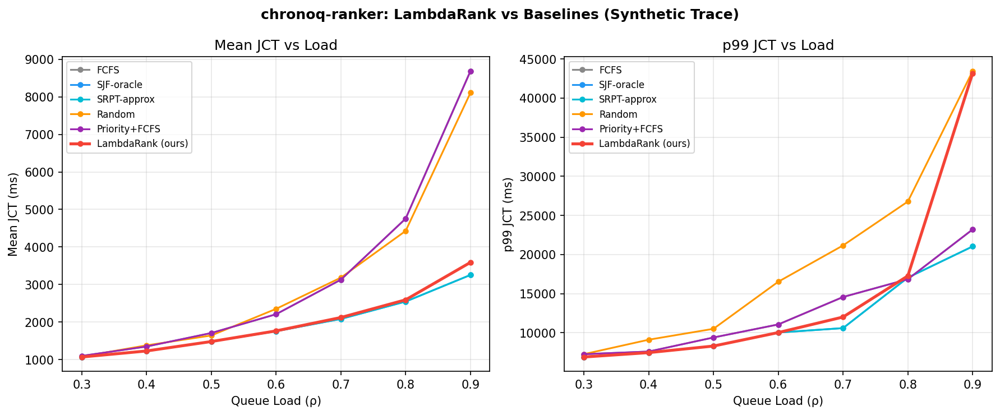

# Chronoq

**Learning-to-rank scheduling for Python job queues.** Replaces FIFO with an online-learning [LambdaRank](https://en.wikipedia.org/wiki/Learning_to_rank) ranker that predicts job duration from telemetry and reorders pending work shortest-job-first. Plug it into Celery, a reference FastAPI+Redis server, or benchmark against public traces — all in one monorepo.


> **Chunks 0–4 complete · v0.2.0 sprint Wave 1 merged.** `chronoq-ranker` (LightGBM LambdaRank, 15 features), `chronoq-bench` (SimPy simulator, 5 baselines, multi-seed + multi-worker experiments), and `chronoq-celery` (Celery plugin, eager demo + Docker A/B stack) are built, tested, and packaged. 244 tests. Wave 2 (real-trace loaders: BurstGPT, Azure, Borg) is next. See [`docs/v2/`](docs/v2/) for design, benchmark results, and integration guide.

---

## Why Chronoq

Every Python task queue (Celery, RQ, Dramatiq, arq, Hatchet, Temporal) schedules in FIFO or static-priority order. On workloads where durations vary 2–4 orders of magnitude — ML training, LLM inference, media transcoding, document AI, data pipelines — this causes head-of-line blocking: short tasks wait behind long ones.

Learned scheduling has been proven repeatedly in research (Resource Central SOSP'17 = 5% packing improvement; Decima SIGCOMM'19 = 21–50% lower JCT; vLLM-LTR NeurIPS'24 = 2.8× lower chatbot latency) but has not propagated to the Python task-queue layer. **Chronoq closes that gap** — with a LambdaRank ranker you can plug into your existing queue.



*LambdaRank vs 5 baselines on Pareto trace. At load=0.7: **+32% mean JCT** and **+17.5% p99 JCT** vs FCFS; within 13.4% of SJF-oracle (theoretical upper bound).*

---

## Evidence

The hero plot above is the headline result. Two more experiments in `bench/chronoq_bench/experiments/` make the case that LambdaRank is learning real scheduling structure, not memorizing a trace. Full methodology and reproduction commands: [`docs/v2/BENCHMARKS.md`](docs/v2/BENCHMARKS.md).

### Feature importance — what the ranker actually uses


Which features carry the ranking signal. `recent_mean_ms_this_type` and `payload_size` dominate — the model learned what the heavy-tail actually predicts duration. The remaining 13 features contribute <1% each.

### Drift recovery — online learning, not a frozen snapshot


When the workload shifts (long `transcode` jobs 3× more frequent), the first incremental retrain cycle recovers ~41% of the p99 gap back toward the pre-shift baseline (20,200 ms → 15,800 ms). The model is learning, not memorizing.

---

## Layout

```
chronoq/
├── ranker/                   # chronoq-ranker — ML library (CPU LightGBM LambdaRank)
├── bench/                    # chronoq-bench — SimPy simulator + 5 baselines + public traces
├── integrations/celery/      # chronoq-celery — Celery plugin (shadow/active/fifo modes)
├── demo-server/              # reference FastAPI+Redis integration (v1, demoted)
└── docs/                     # docs/v1/ (archived), docs/v2/ (current)
```

---

## Status

| Chunk | Status | Deliverable |
|---|---|---|
| 0 — Scaffold + team + docs | ✅ complete | workspace, `.claude/` team, docs restructure — 73 tests |
| 1 — `chronoq-ranker` | ✅ complete | LightGBM LambdaRank — Spearman ρ=0.87, pairwise acc=0.89 |
| 2 — `chronoq-bench` | ✅ complete | `make bench` — **+32% mean JCT, +17.5% p99 vs FCFS** @ load=0.7 |
| 3 — `chronoq-celery` | ✅ complete | `LearnedScheduler` (shadow/active/fifo), +55% mean JCT vs FIFO — 216 tests |
| 4 — Polish + promo | ✅ complete | Bug fixes, `RankerConfig` hyperparams, drift wiring, PyPI metadata, 225 tests |
| v0.2.0 Wave 1 | ✅ merged | Multi-seed bench, multi-worker sim, ablation plots, eager + Docker demos, Windows hotfixes — **244 tests** |
| v0.2.0 Wave 2 | ⏳ pending | Real-trace loaders (BurstGPT, Azure Functions, Google Borg) |

Full milestone detail: [`docs/v2/README.md`](docs/v2/README.md).

---

## Quick Start

```bash
git clone https://github.com/Ahnaf19/chronoq.git
cd chronoq
uv sync
uv run pytest -v                # 244 tests
```

**Run the benchmark** (Chunk 2 — produces the money plot):

```bash
make bench          # ~5 min, writes bench/artifacts/jct_vs_load.png + results.json
make bench-smoke    # <60s CI subset (uses bundled 100-row sample)
```

The money plot (`bench/artifacts/jct_vs_load.png`) shows LambdaRank vs 5 baselines across
load ρ=0.3–0.9. At load=0.7: **+32% mean JCT improvement** and **+17.5% p99 improvement**
over FCFS, within 13.4% of SJF-oracle (the theoretical upper bound).

**Use the ranker library** (Chunk 1):

```python
from chronoq_ranker import TaskRanker, TaskCandidate

ranker = TaskRanker(storage="sqlite:///jobs.db")
ranker.record(task_type="resize", payload_size=2048, actual_ms=312.4)
scored = ranker.predict_scores([
    TaskCandidate(task_id="j1", task_type="transcode", payload_size=8000),
    TaskCandidate(task_id="j2", task_type="resize",    payload_size=500),
])
# scored[0] is the job LambdaRank predicts finishes fastest
```

**Use the Celery integration** (Chunk 3 — +55% mean JCT improvement):

```python
from chronoq_celery import LearnedScheduler, attach_signals
from celery import Celery

app = Celery("myapp", broker="redis://localhost:6379/0")
scheduler = LearnedScheduler(mode="active")  # or "shadow" (log-only) or "fifo"
attach_signals(app, scheduler)

# Submit tasks through the scheduler instead of apply_async directly
scheduler.submit("resize", 1024, lambda: my_task.apply_async(...))
```

Run the demo:

```bash
make celery-demo     # prints fifo vs active JCT table — no Docker required
```

Full quickstart: [`docs/v2/INTEGRATIONS.md`](docs/v2/INTEGRATIONS.md).

**v1 reference server** (demo-server, still works):

```bash
docker compose up                # Redis + FastAPI
curl -X POST http://localhost:8000/tasks -H 'content-type: application/json' \
  -d '{"task_type":"resize","payload_size":1024}'
```

---

## Documentation

| Audience | Start here |
|---|---|
| **Trying Chronoq** | [`docs/v2/README.md`](docs/v2/README.md) — landing + chunk status |
| **Celery quickstart** | [`docs/v2/INTEGRATIONS.md`](docs/v2/INTEGRATIONS.md) — install, modes, seeding, training |
| **Contributing** | [`docs/v2/architecture.md`](docs/v2/architecture.md) — system design |
| **Stack details** | [`docs/v2/tech-stack.md`](docs/v2/tech-stack.md) — dependencies, versions, rationale |
| **Historical (v1)** | [`docs/v1/`](docs/v1/) — FastAPI+Redis architecture (still in `demo-server/`) |

---

## License

MIT — see [LICENSE](LICENSE).
