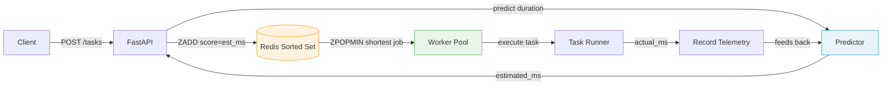
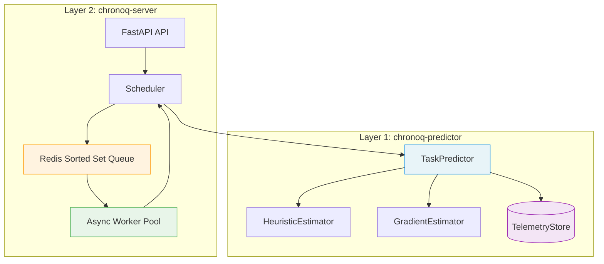

# Chronoq

**A task queue that learns how long your jobs take — and reorders them to minimize wait time.**


[Features](#features) · [Installation](#installation) · [Quick Start](#quick-start) · [Demo](#demo) · [Documentation](#documentation) · [Contributing](#contributing)

---

## Why Chronoq?

Every task queue processes jobs in FIFO order. But FIFO is a poor strategy when a 10-second job is stuck behind a 10-minute job — everything downstream waits. Operating systems solved this decades ago with **Shortest Job First (SJF)** scheduling, which is provably optimal for minimizing average wait time. The catch is that SJF requires knowing how long a job will take *before* it runs.

Chronoq bridges that gap. It learns execution time from historical telemetry and uses those predictions to continuously reorder the queue — so short jobs get processed first, automatically.

---

## Features

- **Self-improving predictions** — starts with a simple per-type heuristic, auto-promotes to GradientBoosting after 50 records. No manual model management.
- **SJF via Redis sorted sets** — tasks scored by predicted duration, `ZPOPMIN` always pops the shortest job. O(log N) insert and dequeue.
- **Two independent layers** — the predictor library works standalone in any project (Celery, Kafka, custom workers). The server is a reference implementation on top.
- **Closed feedback loop** — workers execute tasks, measure actual time, and feed it back to the predictor. Predictions sharpen with every completed job.
- **Thread-safe design** — lock protects only the model pointer swap. Concurrent predictions and recording never block each other.
- **Observable** — REST API exposes queue depth, model type/version, per-worker utilization, and predicted-vs-actual accuracy history.
- **Pluggable storage** — SQLite for persistence, in-memory for testing. Implement `TelemetryStore` to add your own backend.

---

## How It Works



1. Client submits a task with `task_type`, `payload_size`, and optional `metadata`
2. Predictor estimates duration — task enters Redis sorted set with `score = estimated_ms`
3. Workers pop the lowest-score task (shortest predicted job first), execute it
4. Actual duration is recorded back to the predictor — the model learns
5. After 50 records, the predictor auto-promotes from heuristic to GradientBoosting
6. Every 100 new records, the model retrains — predictions get sharper over time

---

## Installation

**Prerequisites:** Python 3.11+, [uv](https://docs.astral.sh/uv/), Redis (for the server)

<details>
<summary><strong>Full system (server + predictor)</strong></summary>

```bash
git clone git@github.com:Ahnaf19/chronoq.git
cd chronoq
uv sync
```

</details>

<details>
<summary><strong>Predictor library only (no Redis needed)</strong></summary>

```bash
pip install ./chronoq_predictor
```

Drop it into any existing project — Celery workers, Kafka consumers, FastAPI background tasks, or custom job runners.

</details>

<details>
<summary><strong>Docker</strong></summary>

```bash
docker compose up
```

Starts Redis + the Chronoq server on `http://localhost:8000`.

</details>

---

## Quick Start

### 1. Start the server

```bash
docker compose up -d redis
uv run uvicorn chronoq_server.main:app --reload
```

### 2. Submit a task

```bash
curl -s -X POST http://localhost:8000/tasks \
  -H "Content-Type: application/json" \
  -d '{"task_type": "resize_image", "payload_size": 2048}' | python -m json.tool
```

```json
{
    "task_id": "a1b2c3d4-...",
    "predicted_ms": 1000.0,
    "confidence": 0.1,
    "model_type": "heuristic"
}
```

### 3. Watch it learn

```bash
# Check metrics after some tasks complete
curl -s http://localhost:8000/metrics | python -m json.tool
```

The `model_type` will shift from `"heuristic"` to `"gradient_boosting"` after 50 completed tasks, and predictions will get progressively more accurate.

### Using the predictor standalone

```python
from chronoq_predictor import TaskPredictor

predictor = TaskPredictor(storage="sqlite:///telemetry.db")

# Before running a task
estimate = predictor.predict("resize_image", payload_size=2048)
# => PredictionResult(estimated_ms=340, confidence=0.82, model_type="gradient_boosting")

# After running it
predictor.record("resize_image", payload_size=2048, actual_ms=312)

# Model retrains automatically — or trigger it manually
result = predictor.retrain()
# => RetrainResult(mae=45.2, samples_used=1200, promoted=False)
```

---

## Demo

The demo submits 200 tasks in waves, giving the predictor time to learn between batches:

```bash
uv run python demo.py
```

```
=======================================================
  Wave 1 (cold start): submitting 60 tasks...
=======================================================

--- 14s elapsed ---
  Queue depth:     38
  Model type:      heuristic              <-- per-type mean only
  Model version:   heuristic-v0

=======================================================
  Wave 3 (post-promotion): submitting 40 tasks...
=======================================================

--- 40s elapsed ---
  Queue depth:     12
  Model type:      gradient_boosting      <-- auto-promoted
  Model version:   gradient-v1

=================================================================
  Prediction Accuracy Summary (200 total samples)
=================================================================
  Early predictions MAE (heuristic):               682 ms
  Late predictions MAE  (gradient boosting):        241 ms
  Improvement:                                     64.7%
```

Early heuristic predictions are off by ~680ms. After auto-promotion to GradientBoosting, error drops to ~240ms — a **65% improvement** that directly translates to better SJF ordering.

---

## API Reference

| Method | Path | Description |
|--------|------|-------------|
| `POST` | `/tasks` | Submit a task — returns prediction and task ID |
| `POST` | `/tasks/batch` | Submit multiple tasks at once |
| `GET` | `/tasks/{id}` | Task status (`pending` / `running` / `completed`) |
| `GET` | `/tasks` | Queue snapshot in SJF order |
| `GET` | `/metrics` | Queue depth, model info, worker stats |
| `POST` | `/metrics/retrain` | Manually trigger model retrain |
| `GET` | `/metrics/predictions` | Predicted-vs-actual accuracy history |

Full request/response examples: [`docs/api-reference.md`](./docs/api-reference.md)

---

## Documentation

| Document | Description |
|----------|-------------|
| [`docs/architecture.md`](./docs/architecture.md) | System design, data flow, component diagram, thread safety model |
| [`docs/user-guide.md`](./docs/user-guide.md) | Setup, standalone predictor usage, integration patterns (Celery/Kafka) |
| [`docs/api-reference.md`](./docs/api-reference.md) | Full REST API with request/response JSON examples |
| [`docs/configuration.md`](./docs/configuration.md) | Environment variables, PredictorConfig, storage URIs, Redis key layout |
| [`docs/postman/`](./docs/postman/) | Postman collection + environment for API testing |

### Architecture



The two layers are independently deployable. The predictor library has **zero dependency** on Redis, FastAPI, or any queue system.

---

## Project Structure

```
chronoq/
├── chronoq_predictor/          # Layer 1 — standalone ML library
│   └── chronoq_predictor/
│       ├── predictor.py        # TaskPredictor: predict / record / retrain
│       ├── models/             # HeuristicEstimator + GradientEstimator
│       ├── storage/            # SQLite + in-memory backends
│       ├── schemas.py          # Pydantic models
│       └── features.py         # Feature extraction
├── chronoq_server/             # Layer 2 — queue system
│   └── chronoq_server/
│       ├── main.py             # FastAPI app with async lifespan
│       ├── core/               # Queue (Redis), Scheduler, Worker pool
│       └── api/                # REST endpoints
├── tests/                      # 71 tests (47 predictor + 24 server)
├── migrations/                 # Alembic schema migrations
├── docs/                       # Architecture, user guide, API reference, Postman
├── demo.py                     # End-to-end demo
├── docker-compose.yml          # Redis + app
└── Dockerfile
```

---

## Design Decisions

<details>
<summary><strong>Why SJF scheduling?</strong></summary>

SJF is provably optimal for minimizing average wait time in non-preemptive scheduling. The trade-off is that long tasks may wait longer (starvation risk) — acceptable for most async workloads where total throughput matters more than strict fairness.

</details>

<details>
<summary><strong>Why auto-promotion instead of starting with ML?</strong></summary>

Cold-start is real. A fresh system has no training data. Starting with a heuristic (per-type mean) gives reasonable predictions immediately. Once 50 records accumulate, the system promotes itself to GradientBoosting to capture non-linear relationships between features and execution time — without operator intervention.

</details>

<details>
<summary><strong>Why two packages instead of one?</strong></summary>

The predictor is useful independently. If you already have a task queue (Celery, Kafka, etc.), you don't need another one — you just need duration predictions. Separating the library means zero unnecessary dependencies and clean integration with any system.

</details>

<details>
<summary><strong>Why Redis sorted sets?</strong></summary>

They give O(log N) insert and O(log N) pop-min — exactly what SJF needs. The score is the predicted duration, and `ZPOPMIN` always returns the shortest predicted job. No scanning, no re-sorting.

</details>

---

## Contributing

Contributions are welcome. See [`CONTRIBUTING.md`](./CONTRIBUTING.md) for development setup, code standards, and PR process.

**Quick version:**

```bash
git clone git@github.com:Ahnaf19/chronoq.git && cd chronoq
uv sync
uv run ruff check . && uv run ruff format --check . && uv run pytest -v
```

- **Bugs:** [Open an issue](https://github.com/Ahnaf19/chronoq/issues) with steps to reproduce.
- **Features:** [Open an issue](https://github.com/Ahnaf19/chronoq/issues) describing the use case.

---

## License

[MIT](./LICENSE)

## Tech Stack

Python 3.11 | FastAPI | Redis | scikit-learn | Pydantic v2 | SQLite | pytest | uv workspace monorepo
