# Chronoq Diagrams

Comprehensive Mermaid diagrams covering architecture, data flows, and system behavior.

---

## 1. System Architecture

High-level view of all components and their relationships.

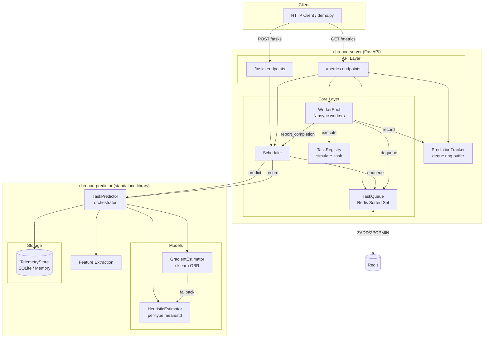

---

## 2. SJF Scheduling Flow

Complete lifecycle of a task from submission through execution to feedback.

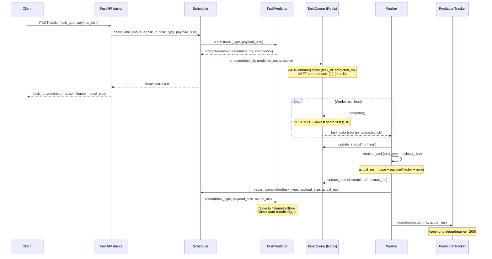

---

## 3. Model Promotion Lifecycle

How the predictor auto-promotes from heuristic to gradient boosting.

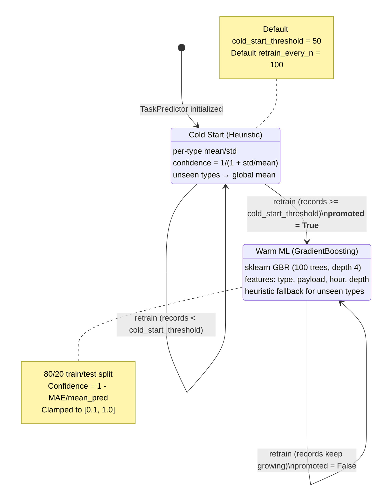

---

## 4. Auto-Retrain Trigger Flow

Decision flow for when and how retraining happens.

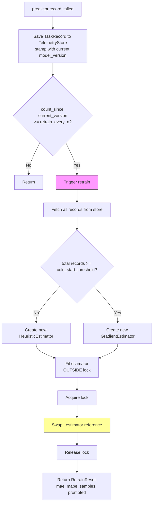

---

## 5. Data Flow Diagram — Level 0 (Context)

High-level external interactions with the system.

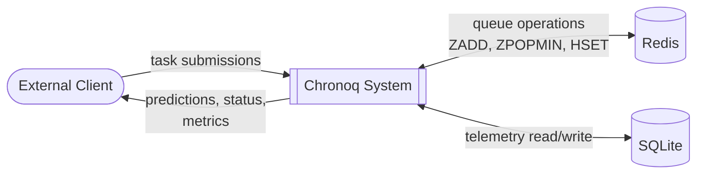

---

## 6. Data Flow Diagram — Level 1

Internal data flows between major processes.

```mermaid
flowchart TB
    USER([Client])

    subgraph "Chronoq System"
        P1[1.0<br/>Submit Task]
        P2[2.0<br/>Predict Duration]
        P3[3.0<br/>Queue Management]
        P4[4.0<br/>Execute Task]
        P5[5.0<br/>Record Telemetry]
        P6[6.0<br/>Retrain Model]
        P7[7.0<br/>Report Metrics]
    end

    REDIS[(Redis<br/>Sorted Set + Hashes)]
    SQLITE[(SQLite<br/>Telemetry Store)]
    MODEL[[ML Model<br/>Heuristic / GBR]]

    USER -->|task_type, payload_size| P1
    P1 -->|task params| P2
    P2 <-->|features / prediction| MODEL
    P2 -->|task_id, predicted_ms| P3
    P3 <-->|ZADD / ZPOPMIN| REDIS
    P3 -->|task_data (SJF order)| P4
    P4 -->|actual_ms| P5
    P5 -->|TaskRecord| SQLITE
    P5 -->|count check| P6
    P6 <-->|read records / update model| SQLITE
    P6 -->|new estimator| MODEL
    P1 -->|prediction result| USER
    USER -->|GET /metrics| P7
    P7 -->|queue_depth| REDIS
    P7 -->|model info| MODEL
    P7 -->|worker stats, predictions| USER
```

---

## 7. Worker Pool Execution

How the async worker pool processes tasks concurrently.

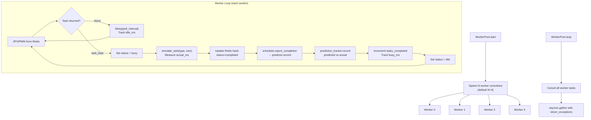

---

## 8. Thread Safety Model

How the predictor handles concurrent predict/record/retrain operations.

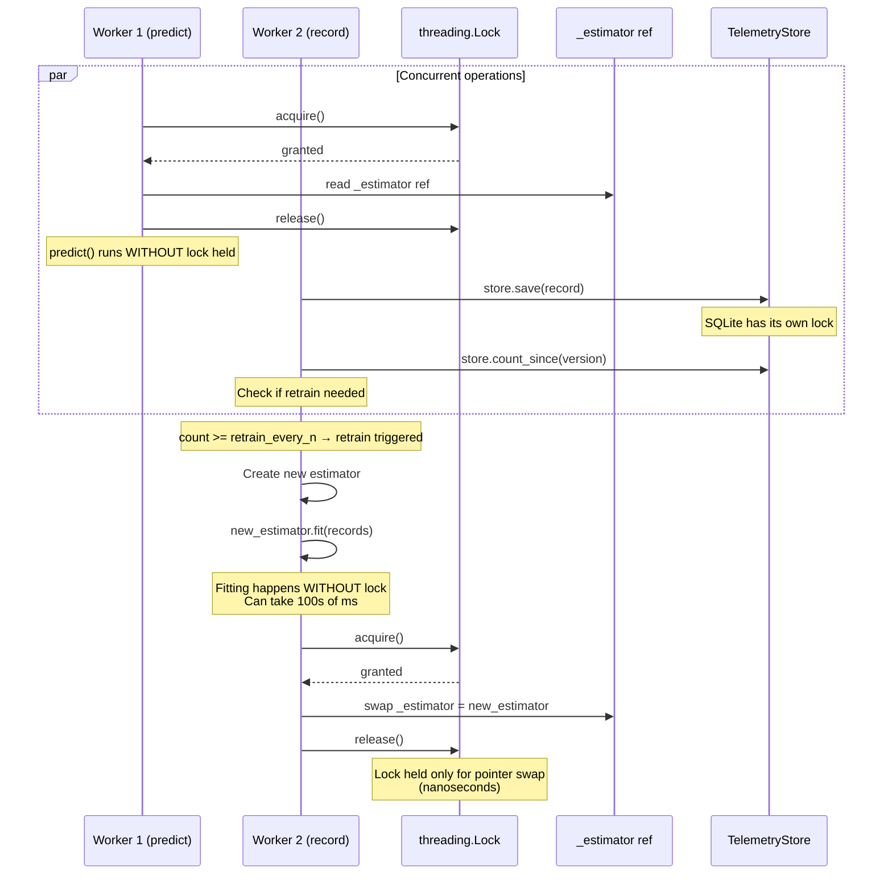

---

## 9. Feature Extraction Pipeline

How raw task parameters become ML features.

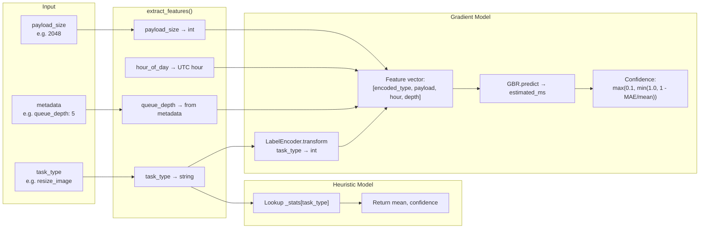

---

## 10. Redis Data Model

How task data is structured in Redis.

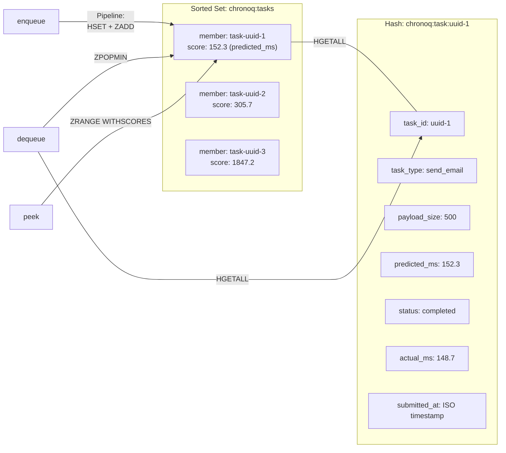

---

## 11. API Request Map

All available HTTP endpoints and their internal routing.

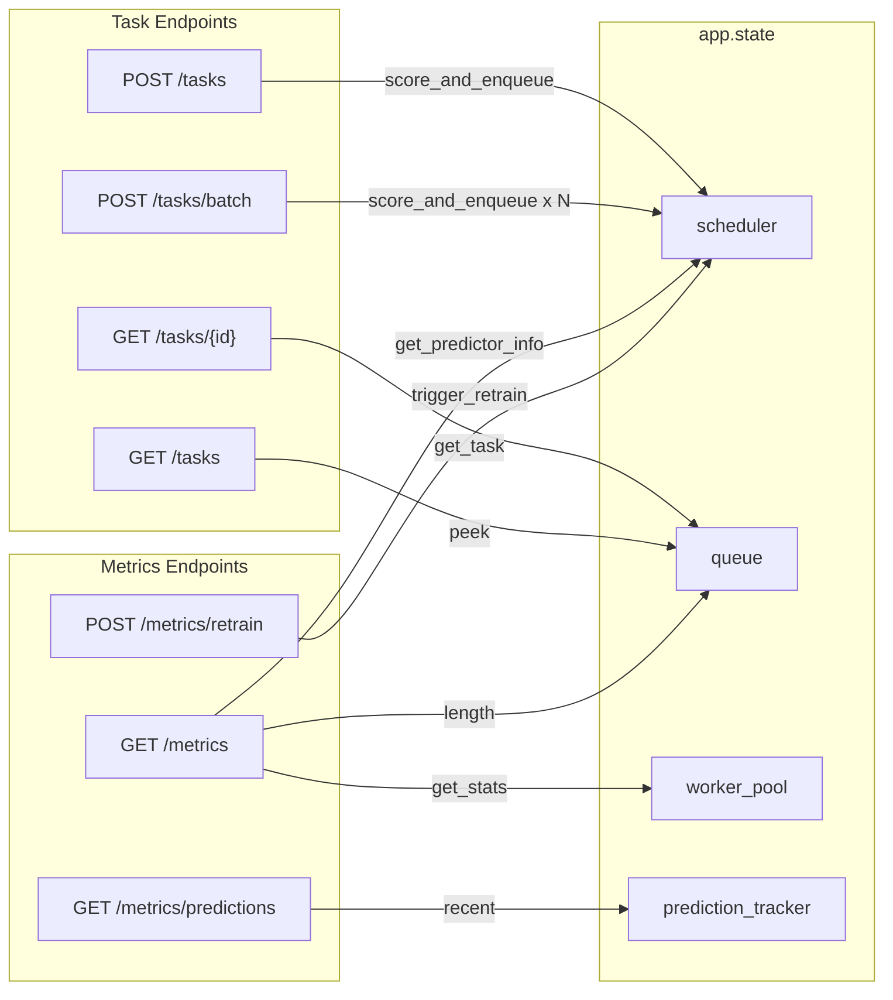

---

## 12. Application Lifespan

Startup and shutdown sequence managed by FastAPI's lifespan context manager.

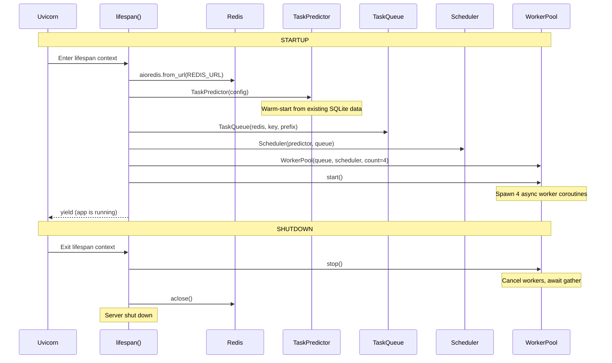
