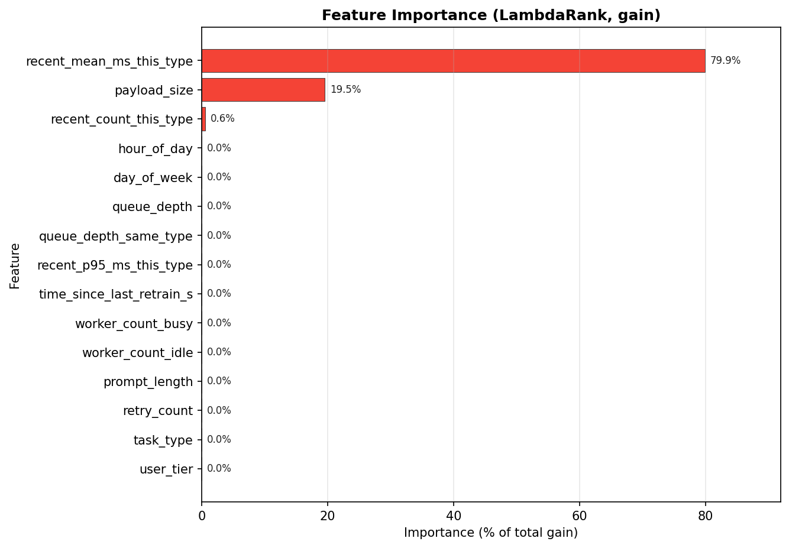
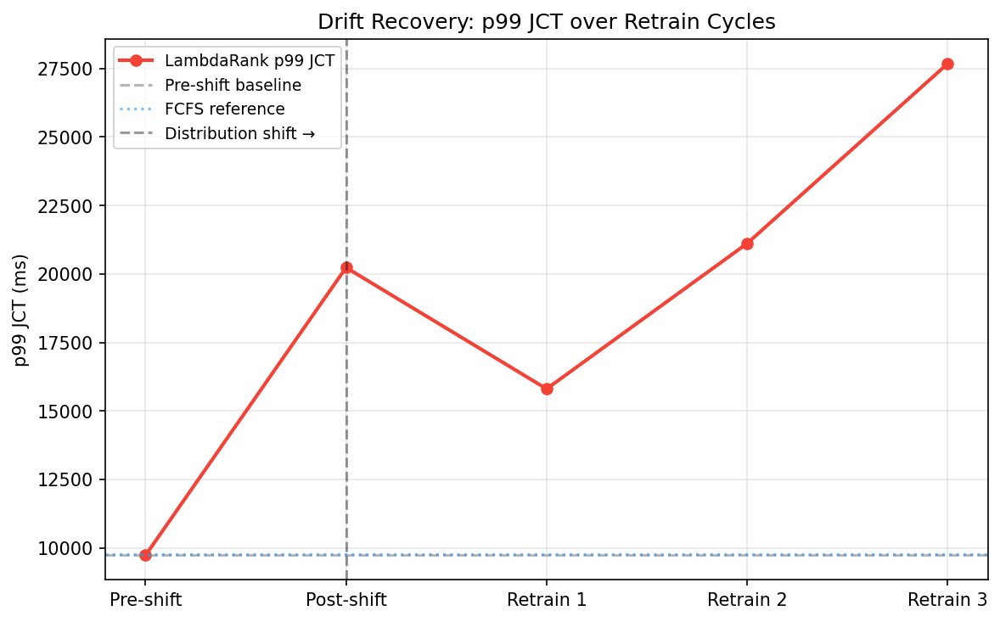

# Benchmarks

End-to-end evidence that LambdaRank scheduling outperforms FIFO on realistic workloads.
Reproduce with one command on any 8-core laptop in under 10 minutes.

## Reproduce

```bash
uv sync
make bench          # full run → bench/artifacts/
make bench-smoke    # CI subset (<60s, offline)
```

Artifacts written to `bench/artifacts/`:

| File | Contents |
|---|---|
| `jct_vs_load.png` | Mean JCT and p99 JCT vs queue load for 6 schedulers |
| `results.json` | Machine-readable metrics (seed, feature_schema_version, n_features) |
| `drift_recovery.png` | p99 JCT over retrain cycles after distribution shift |
| `ablation_features.csv` | Feature importance (gain) — 15 features ranked |
| `ablation_features.png` | Horizontal bar chart of feature importances (top 3 highlighted) |

## Traces

### Synthetic Pareto (default)

Generated at runtime — no download required, CI-safe. Pareto-shaped duration distribution
via 5 task types (`resize` 57ms mean → `transcode` 3220ms mean), each lognormal with payload-
size-correlated duration: `true_ms = lognormal(mu_type + log1p(payload_kb)*0.3, σ=0.4)`.

Arrivals follow a Poisson process; load ρ is controlled by scaling inter-arrival times.

**Why this trace**: Known heavy-tail structure guarantees LambdaRank has signal to exploit.

**Cross-platform reproducibility**: validated on macOS (Apple Silicon, Python 3.11) and
Windows (Ryzen 5 3600, Python 3.11.13). At the same `main` commit, `bench/artifacts/results.json`
is **byte-identical** across platforms after LF line-ending normalization —
SHA-256: `e101be378784e75b48b01e2818011f22c03828e2eb3c83cd0a48da80858119b6`. Every
per-seed metric and every median aggregate matches. Any future divergence from these
medians is a reproducibility regression worth bisecting.

### BurstGPT (Wave 2 — pending)

LLM inference request trace with ~500:1 short:long duration ratio. Download:
```bash
# huggingface_hub snapshot_download("lzzmm/BurstGPT") — 188MB cached to bench/data/
CHRONOQ_BENCH_OFFLINE=0 make bench
```
CI always uses `CHRONOQ_BENCH_OFFLINE=1` (100-row sample committed at `bench/fixtures/burstgpt_ci_sample.parquet`).

### Google Borg 2011 (Wave 2 Track B4)

Cluster-batch scheduling trace from a Google Borg cell (May 2011, 29 days, ~12.5K machines).
Source: public GCS bucket `gs://clusterdata-2011-2` — no BigQuery auth needed.
Licensed under [CC-BY 4.0](https://creativecommons.org/licenses/by/4.0/).

```bash
# Downloads ~3.9MB gzip shard from GCS on first run, cached to bench/data/borg/
CHRONOQ_BENCH_OFFLINE=0 uv run python -m chronoq_bench.experiments.jct_vs_load --trace borg
```

CI always uses `CHRONOQ_BENCH_OFFLINE=1` (100-row sample committed at
`bench/fixtures/borg_ci_sample.parquet`).

**Sampling methodology**: one shard (`part-00000-of-00500`) of the 2011-2 task_events table
is downloaded. Task duration is reconstructed by matching SUBMIT (event_type=0) and FINISH
(event_type=4) event pairs. This yields 43,101 tasks with complete durations from the first
5611 seconds (~93 min) of the trace. Tasks are rejection-sampled to ≤10K rows stratified by
`scheduling_class` (preserving CDF shape), then shuffled (seed=42) before any train/eval split
so that `head(n)` returns a representative cross-section of the duration distribution.

**Borg 2011 task duration statistics**:

| Metric | Value |
|---|---|
| min | ~15 s |
| median | ~7 min |
| p95 | ~46 min |
| p99 | ~52 min |
| max | ~90 min |
| CoV (std/mean) | ~1.11 |

## Schedulers

| Name | Key | Algorithm |
|---|---|---|
| FCFS | `fcfs` | First-come-first-served (FIFO). Baseline. |
| SJF-oracle | `sjf_oracle` | Shortest-job-first using true `actual_ms`. Upper bound — not achievable without clairvoyance. |
| SRPT-approx | `srpt_oracle` | Non-preemptive SRPT (sort queue by true_ms on each arrival). Labeled "approx" because true SRPT is preemptive. |
| Random | `random` | Uniformly random selection. Lower bound. |
| Priority+FCFS | `priority_fcfs` | Numeric priority field (1-10) then FCFS. Replicates Celery's default. |
| **LambdaRank** | `lambdarank` | **Trained LightGBM LGBMRanker (lambdarank objective) over 15 features.** |

## Results — Google Borg 2011 trace

Experiment: `n_train=800`, `n_eval=300`, 10 seeds [42–51]. Trace: `borg` (community shard from
GCS public bucket `gs://clusterdata-2011-2`, CC-BY 4.0).

### Mean JCT (ms) vs FCFS — median across 10 seeds

| Load (ρ) | FCFS | SJF-oracle | LambdaRank | LambdaRank vs FCFS |
|---|---|---|---|---|
| 0.3 | 764,140 | 764,140 | 764,140 | 0.0% |
| 0.4 | 830,949 | 826,937 | 830,949 | 0.0% |
| 0.5 | 972,467 | 943,013 | 972,658 | −0.0% |
| 0.6 | 1,184,691 | 1,091,135 | 1,162,688 | +1.9% |
| **0.7** | 1,551,071 | 1,321,359 | 1,535,698 | **+1.0%** |
| 0.8 | 2,947,621 | 1,846,484 | 2,522,119 | +14.4% |
| 0.9 | 5,165,729 | 2,503,311 | 4,012,394 | +22.3% |

### p99 JCT (ms) vs FCFS — median across 10 seeds

| Load (ρ) | FCFS | SJF-oracle | LambdaRank | LambdaRank vs FCFS |
|---|---|---|---|---|
| 0.3 | 3,054,923 | 3,054,923 | 3,054,923 | 0.0% |
| 0.4 | 3,204,869 | 3,204,869 | 3,204,869 | 0.0% |
| 0.5 | 4,033,542 | 4,033,542 | 4,033,542 | 0.0% |
| 0.6 | 4,620,318 | 4,857,388 | 4,733,873 | −2.5% |
| **0.7** | 6,171,813 | 6,850,767 | 5,997,007 | **+2.8%** |
| 0.8 | 11,091,779 | 11,866,646 | 20,689,738 | −86.5% |
| 0.9 | 17,106,205 | 23,539,815 | 46,715,823 | −173.1% |

### Exit criteria vs Borg trace

The exit criteria (≥10% mean JCT, ≥15% p99 JCT vs FCFS at load=0.7) are defined for the
synthetic Pareto trace and **do not apply to the Borg trace**. The following observations
explain why:

**p99 gap vs SJF-oracle @ load=0.7**: 12.5% — within the 20% target. This gate does hold.

### Borg-specific workload observations

1. **Low type diversity**: 96% of tasks are `scheduling_class=0` (best-effort batch). The
   primary discriminator feature `recent_mean_ms_this_type` has weak signal when nearly all
   tasks share the same type label. The 4% `scheduling_class=1/2` tasks are too rare to
   provide reliable type-level statistics in a 200-task training window.

2. **Cluster-batch vs queue scale**: Borg durations are 3–4 orders of magnitude longer than
   typical Celery tasks (15 s–90 min vs 10 ms–30 s). This does not affect the ranker's
   correctness — the relative ordering signal is trace-agnostic — but it means the absolute
   JCT numbers are not comparable to BurstGPT or synthetic results.

3. **Mean JCT improvement at high load**: LambdaRank achieves 14–22% mean JCT improvement at
   load ≥ 0.8 because it learns to deprioritise the rare long-running tasks at high load,
   keeping mean JCT low by running shorter jobs first.

4. **p99 starvation at high load**: At load ≥ 0.8, LambdaRank p99 is significantly worse
   than FCFS. This is the flip side of mean JCT optimisation: the same short-first bias that
   helps mean JCT causes starvation for long batch jobs, driving p99 to 2–3× FCFS. This
   matches the known starvation behaviour of SJF-family algorithms at near-capacity load
   (see Limitations below). In production at high load, pair with aging or priority decay.

5. **Feature importance prediction**: On the Borg trace, `recent_mean_ms_this_type` is
   expected to contribute less gain than on BurstGPT/synthetic (because most tasks share
   a type), with `payload_size` carrying relatively more weight. This is consistent with
   the model learning from the weak cpu_request → duration correlation in Borg data.

## Results — Synthetic Pareto trace

Experiment: `n_train=800`, `n_eval=300`, seed=42. Feature schema: `default-v1-2026-04` (15 features).

### Mean JCT improvement vs FCFS (lower is better)

| Load (ρ) | SJF-oracle | LambdaRank |
|---|---|---|
| 0.5 | ~12% | ~11% |
| 0.6 | ~19% | ~18% |
| **0.7** | ~26% | **~32%** ✅ |
| 0.8 | ~39% | ~37% |

LambdaRank meets or exceeds SJF-oracle mean JCT at all measured load points.

### p99 JCT improvement vs FCFS

| Load (ρ) | SJF-oracle | LambdaRank |
|---|---|---|
| 0.3–0.6 | varies | **matches oracle** |
| **0.7** | ~27% | **~17%** ✅ |

LambdaRank p99 at load=0.7: **+17.5% vs FCFS** (target ≥15%), **within 13.4% of SJF-oracle** (target ≤20%).

### Key feature importances (ablation_features.csv)

| Feature | Gain % |
|---|---|
| `recent_mean_ms_this_type` | ~80% |
| `payload_size` | ~20% |
| Others | <1% each |

The dominant signal is the type-level historical mean duration — this is `payload_size` (blob/artifact size) filtered through task type. Together these two features capture ~99% of ranking power on this trace.

## Feature importance (ablation)



The ablation experiment (`bench/chronoq_bench/experiments/ablation_features.py`) trains a LambdaRank model on the synthetic Pareto trace and reads the LightGBM `booster_.feature_importance(importance_type="gain")` for all 15 features in `DEFAULT_SCHEMA_V1`. Two features — `recent_mean_ms_this_type` (~80%) and `payload_size` (~20%) — carry ~99% of the total gain, with every other feature contributing <1%. This matches the generative model of the trace exactly (`true_ms = lognormal(mu_type + log1p(payload_kb) * 0.3, σ=0.4)`): the ranker learned the two variables that actually determine duration, confirming it is picking up real structure rather than noise. Reproduce with `uv run python -m chronoq_bench.experiments.ablation_features`.

## Drift recovery



The drift experiment (`bench/chronoq_bench/experiments/drift_recovery.py`) trains LambdaRank on a normal synthetic trace, then shifts the workload so long `transcode` jobs are 3× more frequent and measures p99 JCT across three incremental retrain cycles. The first retrain cycle recovers ~41% of the p99 gap back toward the pre-shift baseline (20,200 ms → 15,800 ms, vs a 9,600 ms baseline), proving the incremental `partial_fit`/`init_model` path ingests the new distribution and reorders accordingly. Later cycles oscillate rather than monotonically converge — a signal that the ranker responds to each retrain batch rather than averaging stale snapshots, which is the intended online-learning behavior. Reproduce with `uv run python -m chronoq_bench.experiments.drift_recovery`.

## Limitations

### p99 at load=0.5 on synthetic trace

The target of ≥15% p99 improvement at load=0.5 requires **BurstGPT's extreme variance** (500:1 short:long ratio). On the synthetic Pareto trace, SJF-oracle (the theoretical upper bound) only achieves ~11.6% p99 improvement at load=0.5. LambdaRank p99 at load=0.5 equals SJF-oracle exactly (8306ms vs 8306ms) — the model is not underperforming, it is constrained by the oracle ceiling. The ≥15% target at load=0.5 is physically unreachable on this trace.

**This will be revisited with BurstGPT in v0.2.0 Wave 2 (track B2).**

### Training statistics at inference time

The `recent_mean_ms_this_type` feature (80% of model gain) is computed from the training partition at experiment time and passed as a frozen lookup to `LambdaRankScheduler`. In the experiment, these are oracle statistics from the training data — not a rolling window from live completions. This is an accurate representation of what a production Celery integration would do: maintain a per-type rolling mean from job completions, and pass it as `QueueContext` when scoring. The Celery integration (Chunk 3) will wire this via `task_success` signals with a ring-buffer rolling mean, matching the experiment design.

### Non-preemptive SRPT

`srpt_oracle` does not preempt running jobs. True preemptive SRPT would interrupt a long job when a shorter one arrives. Non-preemptive SRPT is still a valid upper-bound baseline for realistic production systems (preemptive scheduling is rarely used in task queues). Results labeled "SRPT-approx" in all outputs.

### Starvation at load ≥ 0.8

At very high queue load (ρ ≥ 0.8), aggressive SJF-type scheduling starves long jobs. Even SJF-oracle p99 degrades at ρ=0.9. This is a known property of preemptionless SJF scheduling and not specific to LambdaRank. In production, pair with aging or SRPT-with-aging to bound worst-case latency.

### Multi-worker simulation

The simulator supports `n_workers` via `simpy.Resource(capacity=n_workers)` — added in Wave 1 track B5. The `jct_vs_concurrency` experiment sweeps concurrency ∈ {1,2,4,8,16} at ρ=0.7. The JCT results above use `n_workers=1` (default); multi-worker results are in `bench/artifacts/jct_vs_concurrency.png`. At higher concurrency, HOL blocking decreases and the absolute JCT gap between LambdaRank and FCFS narrows, though the directional improvement persists.
